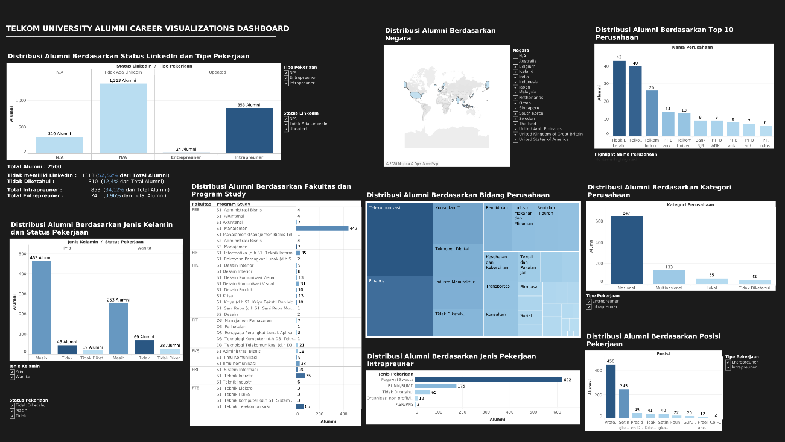
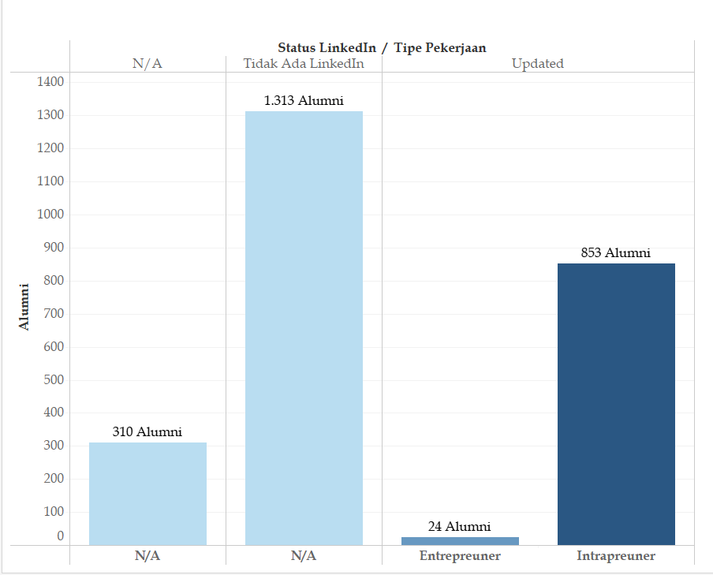
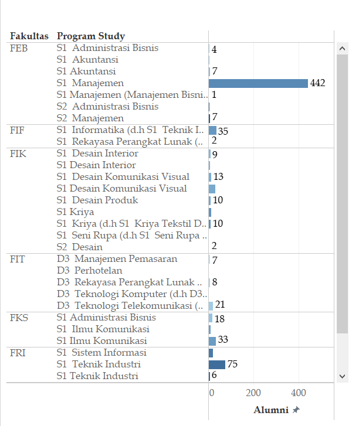
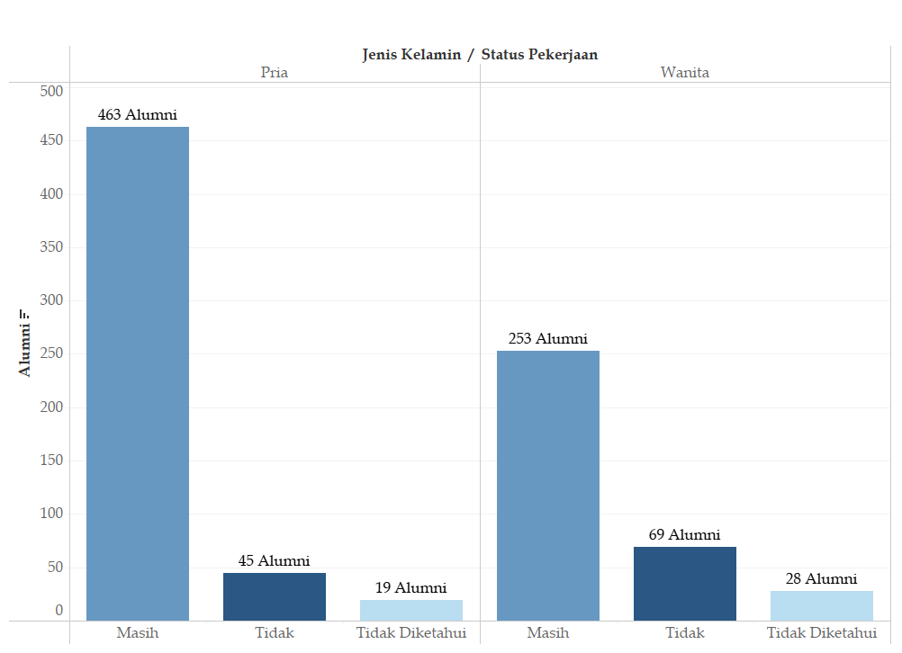
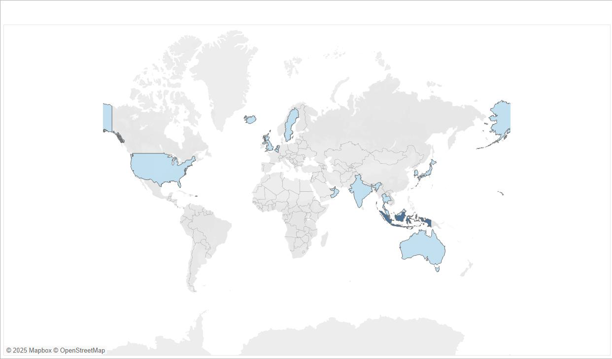
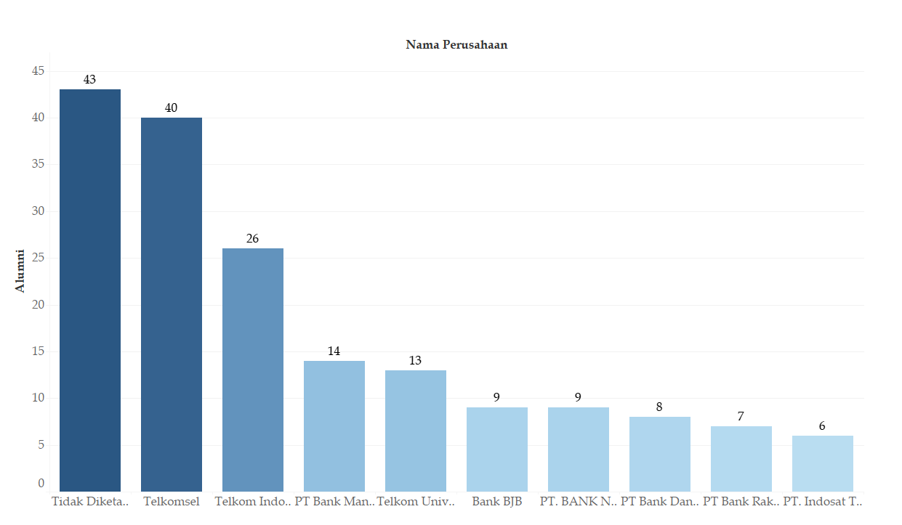
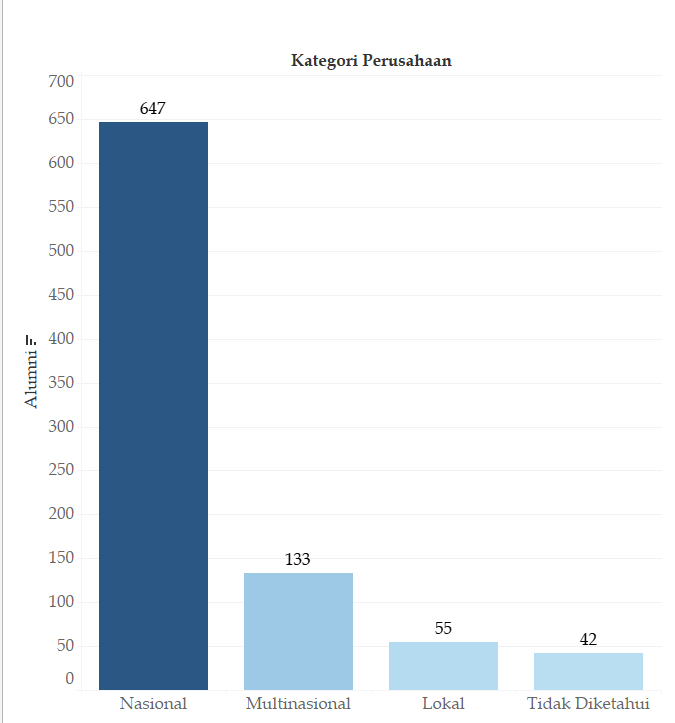
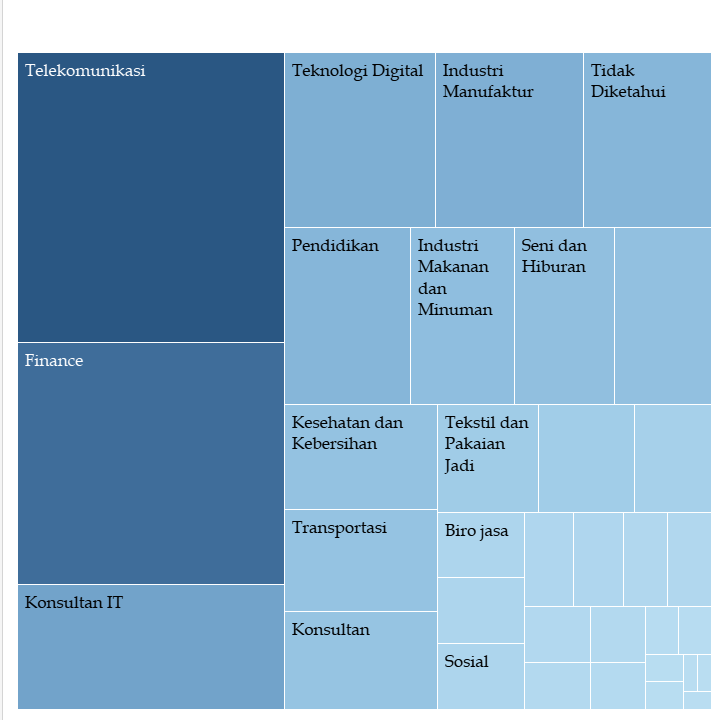
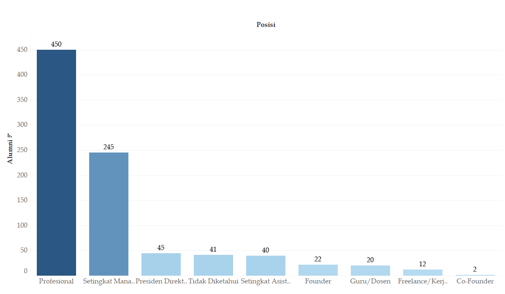
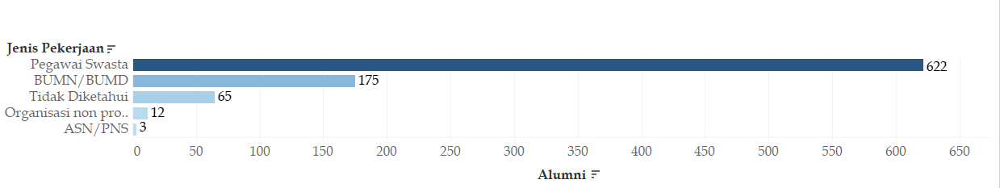

# Visualization and Analysis of Telkom University Alumni Data from LinkedIn

An interactive dashboard built to visualize and analyze the career distribution of Telkom University alumni, developed during an internship at the Directorate of Student Affairs, Career Development, and Alumni (CAE) — Telkom University.

---

## Background

Alumni data is a strategic asset for any university. Telkom University graduates thousands of students each year, and understanding where they end up (what industries they work in, what positions they hold, where they are geographically) is critical for curriculum development, accreditation, and alumni engagement.

This project collected, cleaned, and visualized career data from 2,500 alumni profiles sourced manually from LinkedIn, and presented the findings through an interactive Tableau dashboard.

---

## Objectives

- Map the career distribution of Telkom University alumni across industries and sectors
- Analyze the proportion of alumni working as intrapreneurs vs entrepreneurs
- Visualize the geographic distribution of alumni nationally and internationally
- Deliver actionable insights to support strategic decision-making for the directorate

---

## Tools

- LinkedIn
- Microsoft Excel
- Tableau

---

## Dashboard Overview

The interactive dashboard consists of 9 key visualizations:

1. Alumni distribution by LinkedIn status and job type
2. Alumni distribution by faculty and study program
3. Alumni distribution by gender and employment status
4. Geographic distribution of alumni (national and international)
5. Top 10 companies employing alumni
6. Alumni distribution by company category (national, multinational, local)
7. Alumni distribution by industry sector (treemap)
8. Alumni distribution by job position
9. Alumni distribution by intrapreneur job type

---

## Key Findings

- Out of 2,500 alumni, the majority chose intrapreneur careers (853 alumni, 34.12%) over entrepreneur (24 alumni, 0.96%)
- Most alumni are employed at national companies (647 alumni), followed by multinational companies (133 alumni)
- The telecommunications and digital technology sectors dominate alumni career distribution
- Telkomsel and Telkom Indonesia are the top employers among alumni
- Most alumni hold professional-level positions (450 alumni), followed by managerial roles (245 alumni)
- The majority of alumni are based in Indonesia, with notable concentrations in Singapore, the United States, and Malaysia
- Faculty of Economics and Business (FEB), particularly S1 Management, contributed the most data due to job description allocation during data collection

---

## Dashboard Preview

> Data used in this project is classified. Dashboard previews are intentionally obscured to protect alumni privacy.

### Full Dashboard

### Individual Visualizations

---

## Data Disclaimer

The dataset used in this project contains personal alumni information collected from LinkedIn and is classified under Telkom University's data policy. Raw data and source files are not included in this repository.

---

## Internship Context

**Organization:** Directorate of Student Affairs, Career Development, and Alumni (CAE) — Telkom University

**Period:** July 1, 2024 – September 1, 2024

**Program:** S1 Informatics, Faculty of Informatics, Telkom University